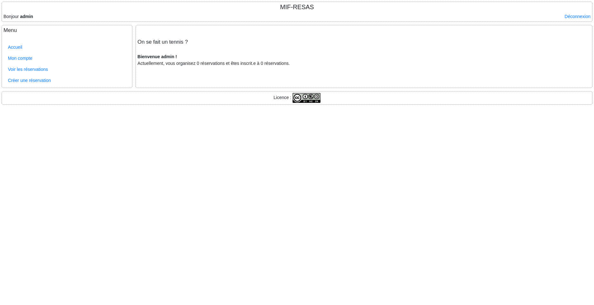
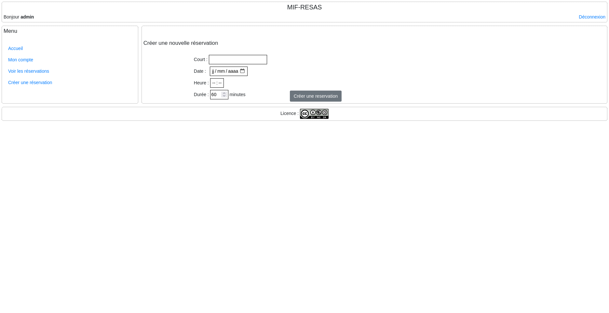
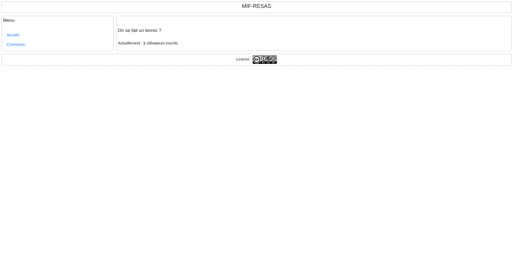
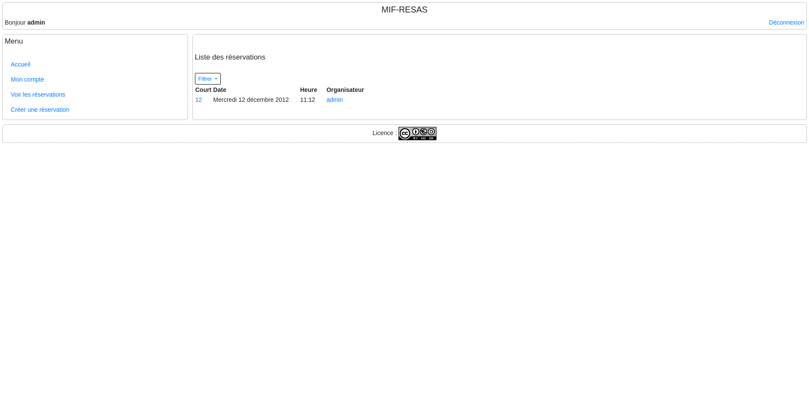
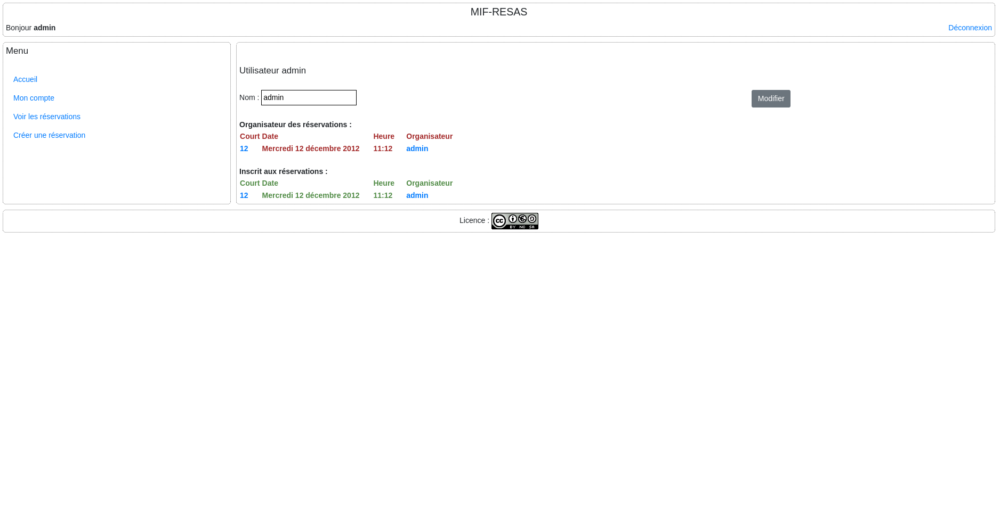

# 📁 Gestionnaire de Réservation

> Application web de gestion de réservation réalisée dans le cadre du cours M1IF03 (2024-2025).  
Elle permet aux utilisateurs de se connecter, de créer des réservations, et de gérer leurs sessions.

## 🛠️ Technologies utilisées

## 📸 Captures d’écran

### Page d'accueil  

### Création d'une réservation  

### Connexion  

### Liste des réservations  

### Espace utilisateur  

