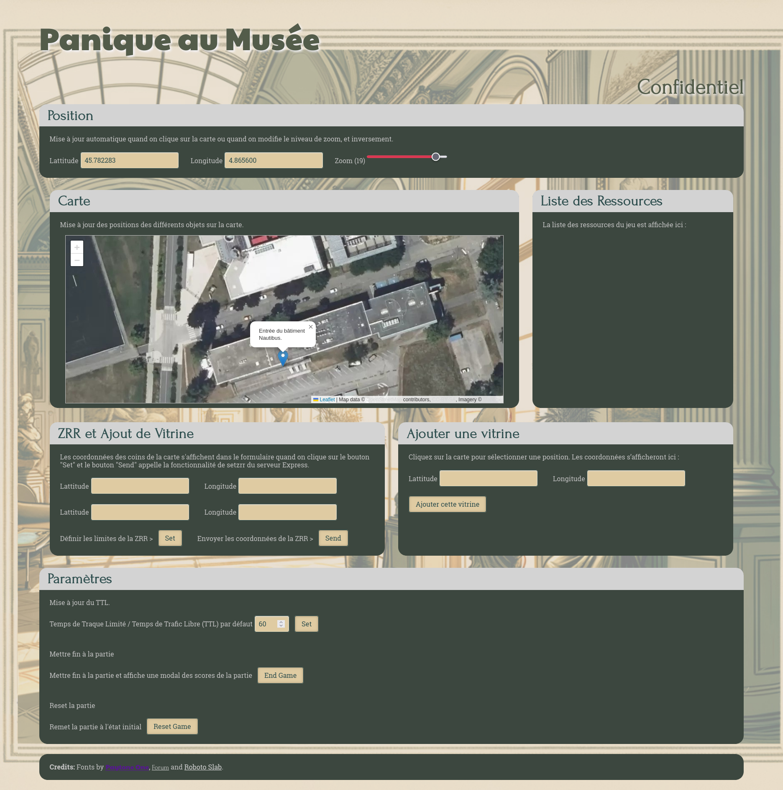
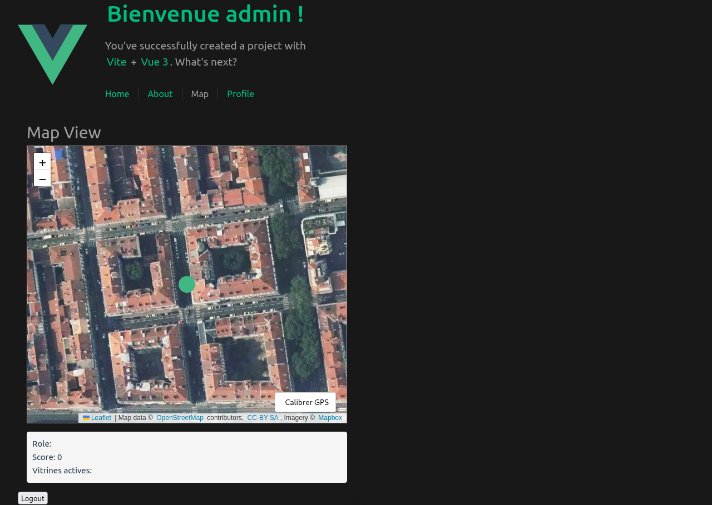

# 🎮 Panique au Musée

> Application web ludique développée dans le cadre du cours M1IF13 (2024-2025).  
Il s’agit d’un jeu interactif opposant des joueur soit voleur soit Policier avec un administrateur qui gère la partie, le tout dans un univers muséal.

## 🛠️ Technologies utilisées

## 📸 Captures d’écran

### Interface administrateur  

### Vue côté joueur  

