# 📁 Application Mini Pinterest

> Site de type Pinterest permettant aux utilisateurs d’ajouter, consulter et classer des photos. Un panneau d’administration permet de gérer les utilisateurs et catégories.

## 🛠️ Technologies utilisées

   

## 📸 Captures d’écran

### Page d'accueil utilisateur  
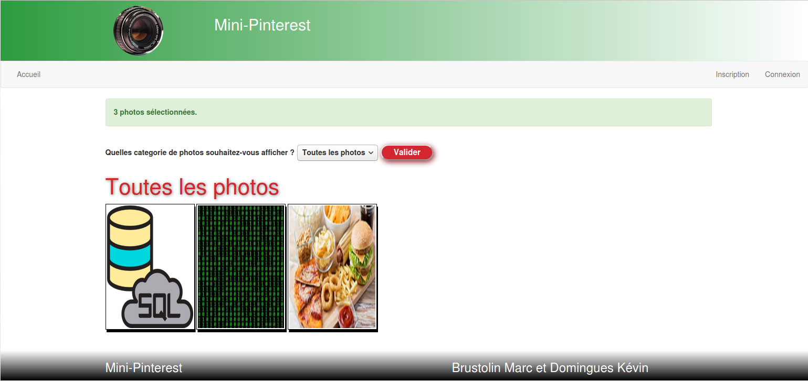

### Accueil administrateur  
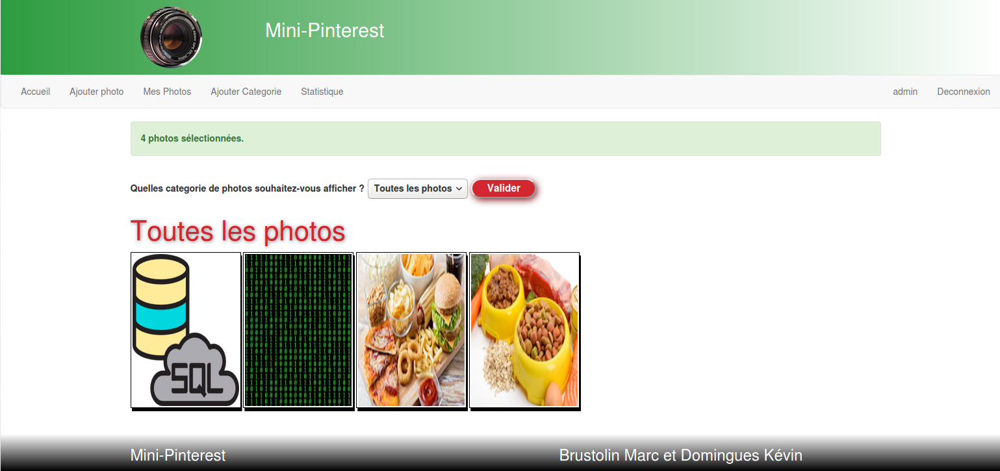

### Ajout de catégories (admin)  
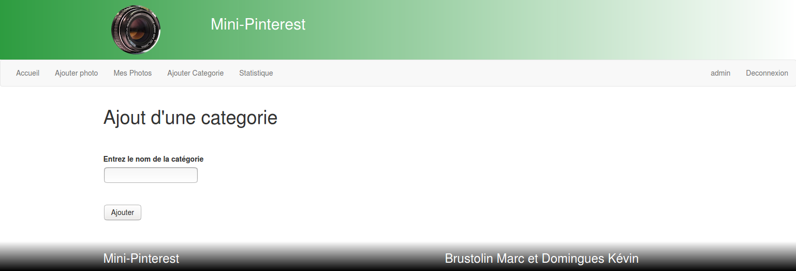

### Gestion de ses photos (admin)  
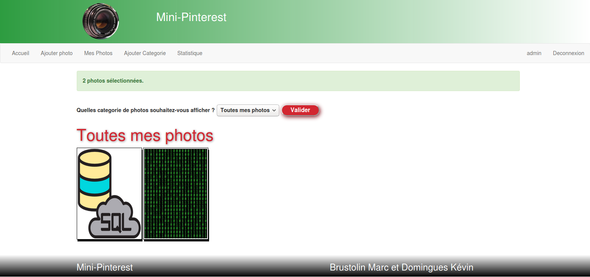

### Détails d'une photo  
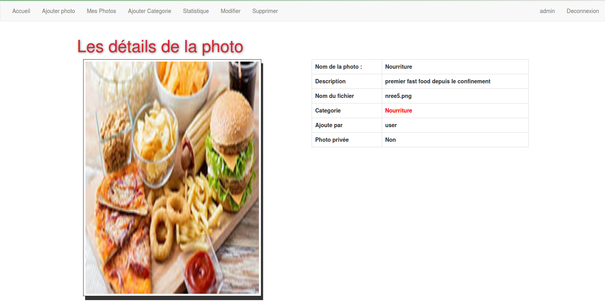

### Gestion du profil admin  
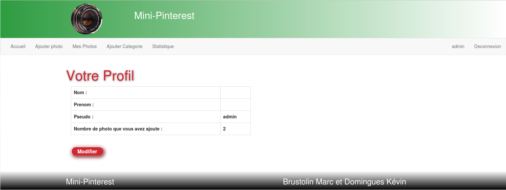

### Ajout d'une photo  
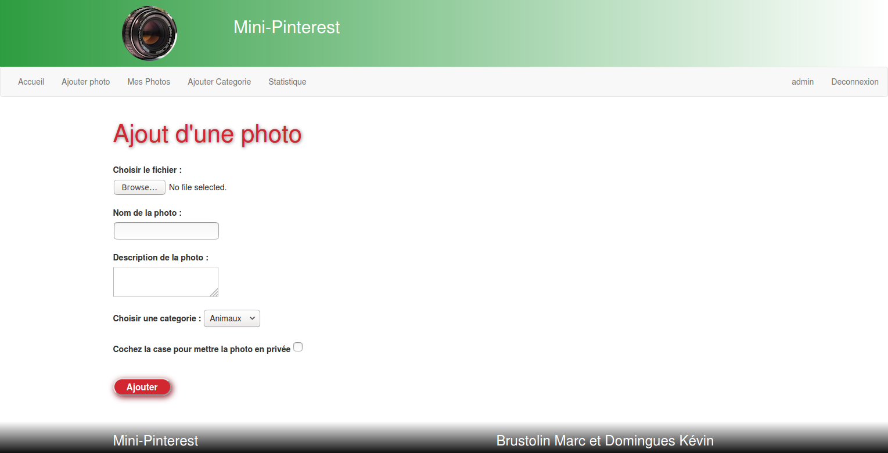

### Page de connexion  
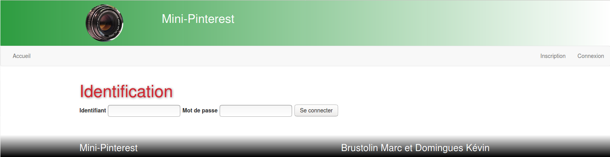

### Modification du profil  
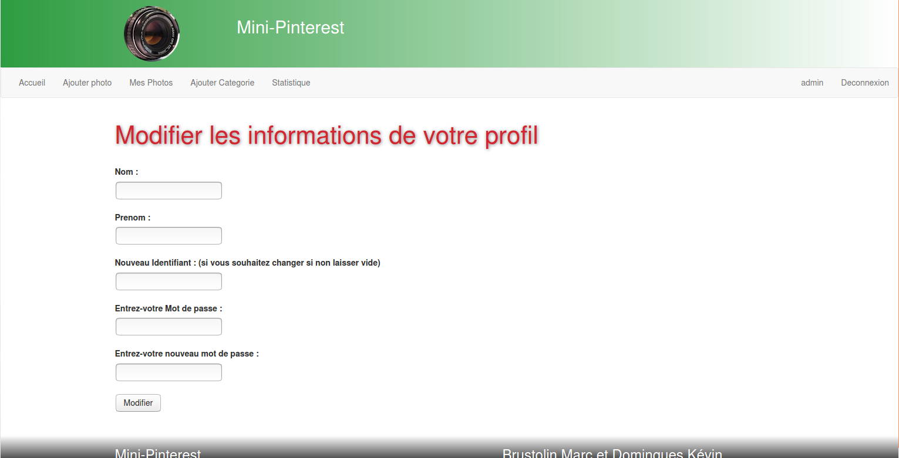

### Photos pour une catégorie sélectionnée  
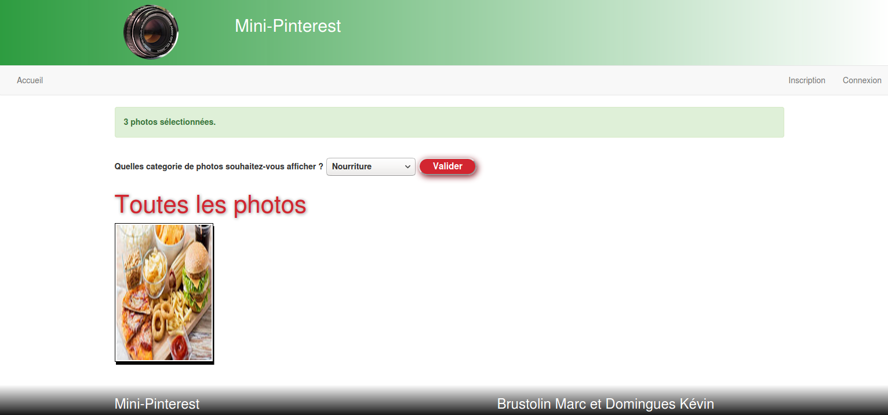

### Statistiques administrateur  
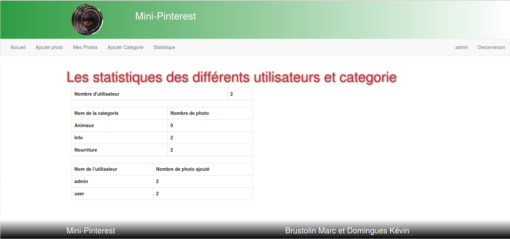
