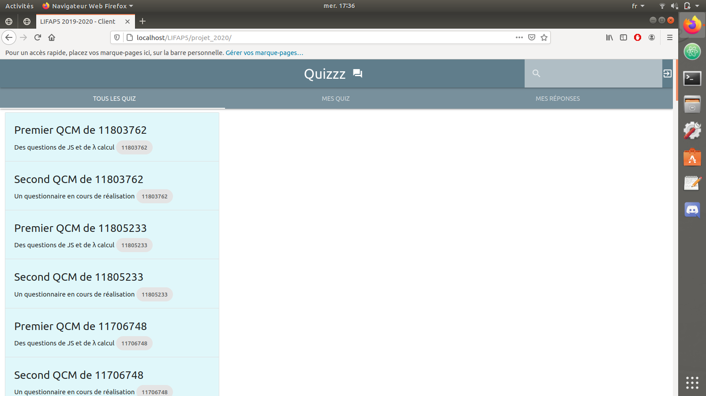
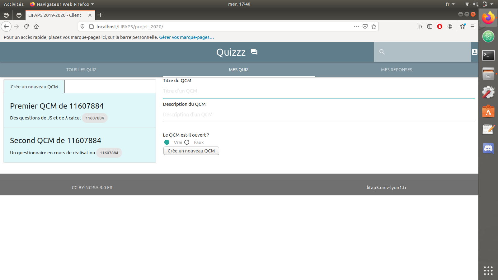
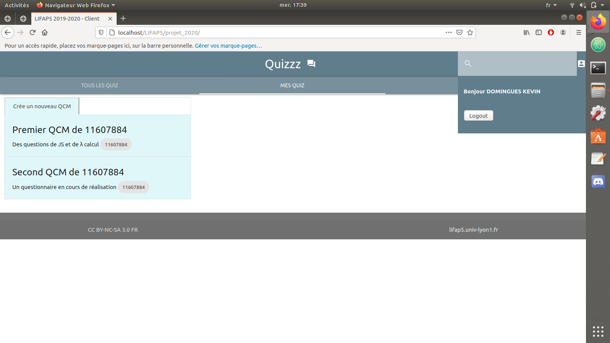
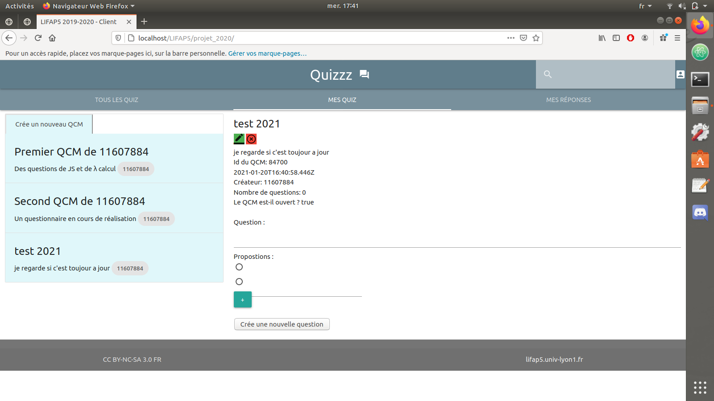

# 📁 Gestionnaire De QCM

> Application web permettant de créer, modifier et gérer des QCM. Développée dans le cadre du projet LIFAP5.

## 🛠️ Technologies utilisées

  

## 📸 Captures d’écran

### Accueil de l'application  

### Création d'un nouveau QCM  

### Espace personnel de l'utilisateur  

### Modification et gestion des questions  

